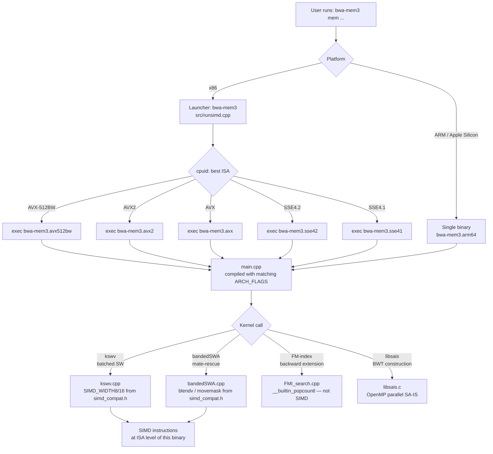

# SIMD dispatch architecture

bwa-mem3 uses two complementary mechanisms to select the best available SIMD code path at run time: a **multi-binary launcher** on x86 (handled separately in [Multi-binary launcher](launcher.md)) and **compile-time conditional compilation** inside each kernel, mediated by `src/simd_compat.h`.

This page covers the compile-time layer: what the macros do, which kernels are vectorised at each ISA level, and how the dispatch decision flows.

## The `simd_compat.h` abstraction layer

`src/simd_compat.h` is the single point where platform detection and intrinsic selection occur. It is included by every file that touches SIMD code. The header resolves to one of four paths:

| Platform | Branch condition | Intrinsic headers |
|---|---|---|
| ARM / Apple Silicon | `__ARM_NEON` or `__aarch64__` | `sse2neon.h` (translation) + `<arm_neon.h>` (native) |
| x86 AVX-512BW | `__AVX512BW__` | `<immintrin.h>` |
| x86 AVX2 | `__AVX2__` | `<immintrin.h>` |
| x86 SSE4.1 / SSE2 | `__SSE4_1__` or `__SSE2__` | `<smmintrin.h>` + `<emmintrin.h>` |

The ARM path defines `APPLE_SILICON 1`, sets `SIMD_WIDTH8 = 16` and `SIMD_WIDTH16 = 8` (128-bit NEON lanes), defines a `posix_memalign`-backed `_mm_malloc` replacement that enforces the 128-byte Apple Silicon cache-line alignment, and provides two optimised NEON helpers that sse2neon does not generate efficiently:

- `_mm_movemask_epi16` — extracts the MSB of each 16-bit element using `vshrq_n_u16` + `vmovn_u16` + position-weighted `vaddv_u8`, replacing the `_mm_movemask_epi8(v) & 0xAAAA` pattern used in `bandedSWA.cpp`.
- `_mm_blendv_epi16_fast` — a bitwise select on 16-bit elements via NEON `vbslq_s16`, replacing the OR/AND/ANDNOT sequence sse2neon emits for `_mm_blendv_epi8`.

`SIMD_WIDTH8` and `SIMD_WIDTH16` control the lane counts in `kswv.cpp` and `bandedSWA.cpp`. On x86 they are set by the architecture-specific header rather than here; the macros differ per ISA level:

| ISA | `SIMD_WIDTH8` | `SIMD_WIDTH16` |
|---|---|---|
| SSE4.1 | 16 | 8 |
| AVX2 | 32 | 16 |
| AVX-512BW | 64 | 32 |
| ARM NEON | 16 | 8 |

## Dispatch diagram

The full dispatch decision, from the shell to a kernel instruction, follows this flow:

## Per-kernel vectorisation status

| Kernel | SSE4.1 | AVX2 | AVX-512BW | ARM NEON |
|---|---|---|---|---|
| `kswv` (batched Smith-Waterman) | vectorised | vectorised (2x width) | vectorised (4x width) | native NEON |
| `bandedSWA` (banded SW / mate-rescue) | vectorised | vectorised | vectorised | native NEON blendv |
| `FMI_search` (FM-index backward ext.) | scalar | scalar | scalar | scalar |
| `libsais` (BWT / SA construction) | OpenMP only | OpenMP only | OpenMP only | OpenMP only |
| `bam_writer` (BAM serialisation) | — | — | — | — |

`FMI_search` is memory-bound with sequential pointer-chasing dependencies; adding SIMD to it produces no measurable speedup. `libsais` benefits from OpenMP-parallel induced sorting but not from SIMD widening within a single thread.

## Adding a new SIMD kernel

1. Include `simd_compat.h` rather than any platform intrinsic header directly.
2. Use `SIMD_WIDTH8` / `SIMD_WIDTH16` for lane-count arithmetic so the code compiles correctly across all ISA levels.
3. For ARM-specific optimisations, gate them with `#ifdef APPLE_SILICON` (or `#if defined(__ARM_NEON)`) and provide a `simd_compat.h`-routed fallback for x86.
4. Verify correctness on at least SSE4.1 (lowest supported x86 level) and ARM64 using `make test`.

> **Tip — Testing SIMD correctness**
>
> The kswv unit tests in `test/unit/test_kswv*.cpp` use synthetic sequence-pair generators
> that drive edge cases (empty batches, nrow==0, homopolymers) across every SIMD width.
> Run them with `./test/bwa_mem3_tests_unit --test-suite="unit/kswv"` after modifying
> any vectorised kernel.

---

**See also:**
[Multi-binary launcher](launcher.md) ·
[Apple Silicon / NEON port](neon-port.md) ·
[Building from source](building.md) ·
[Performance → SIMD dispatch matrix](../performance/simd-dispatch.md) ·
[Regression test framework](regression-tests.md)
