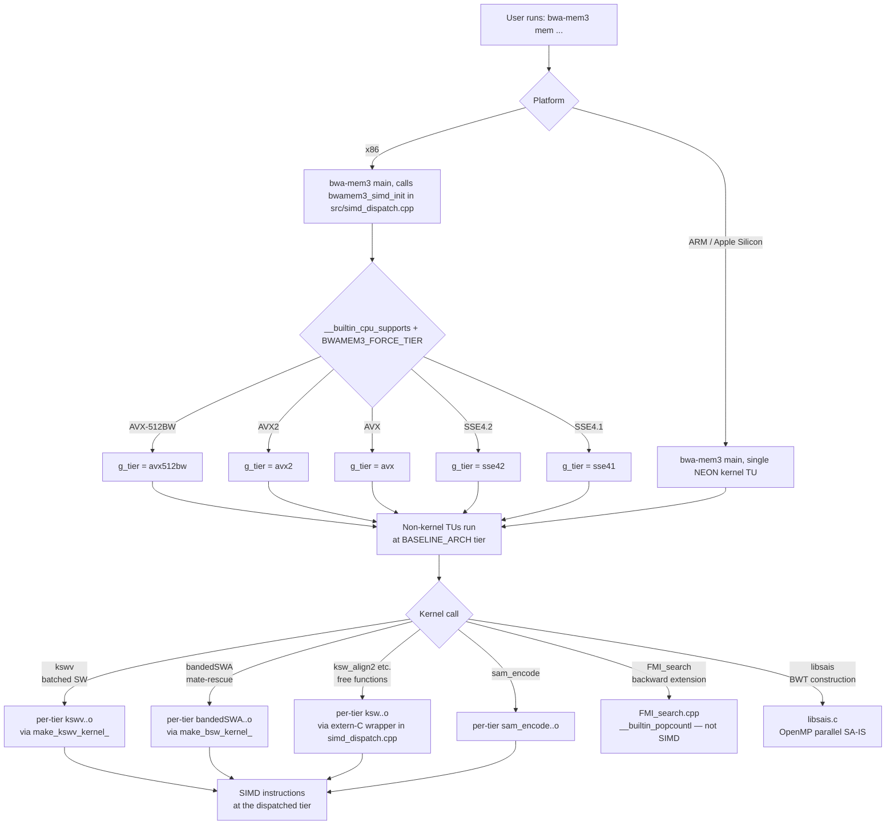

# SIMD dispatch architecture

bwa-mem3 uses two complementary mechanisms to run the best available
SIMD code path at run time: **in-process tier dispatch** on x86
(handled separately in
[Single-binary SIMD dispatch (x86)](launcher.md)) and **compile-time
conditional compilation** inside each kernel translation unit,
mediated by `src/simd_compat.h` and `src/kernel_dispatch.h`.

This page covers the compile-time layer: what the macros do, which
kernels are vectorised at each ISA level, and how the dispatch
decision flows from `main()` to a tier-specific kernel instruction.

## The `simd_compat.h` abstraction layer

`src/simd_compat.h` is the single point where platform detection and
intrinsic selection occur. It is included by every file that touches
SIMD code. The header resolves to one of four paths:

| Platform | Branch condition | Intrinsic headers |
|---|---|---|
| ARM / Apple Silicon | `__ARM_NEON` or `__aarch64__` | `sse2neon.h` (translation) + `<arm_neon.h>` (native) |
| x86 AVX-512BW | `__AVX512BW__` | `<immintrin.h>` |
| x86 AVX2 | `__AVX2__` | `<immintrin.h>` |
| x86 SSE4.1 / SSE2 | `__SSE4_1__` or `__SSE2__` | `<smmintrin.h>` + `<emmintrin.h>` |

The ARM path defines `APPLE_SILICON 1`, sets `SIMD_WIDTH8 = 16` and
`SIMD_WIDTH16 = 8` (128-bit NEON lanes), defines a
`posix_memalign`-backed `_mm_malloc` replacement that enforces the
128-byte Apple Silicon cache-line alignment, and provides two
optimised NEON helpers that sse2neon does not generate efficiently:

- `_mm_movemask_epi16` — extracts the MSB of each 16-bit element using `vshrq_n_u16` + `vmovn_u16` + position-weighted `vaddv_u8`, replacing the `_mm_movemask_epi8(v) & 0xAAAA` pattern used in `bandedSWA.cpp`.
- `_mm_blendv_epi16_fast` — a bitwise select on 16-bit elements via NEON `vbslq_s16`, replacing the OR/AND/ANDNOT sequence sse2neon emits for `_mm_blendv_epi8`.

`SIMD_WIDTH8` and `SIMD_WIDTH16` control the lane counts in `kswv.cpp`
and `bandedSWA.cpp`. The macros differ per ISA level:

| ISA | `SIMD_WIDTH8` | `SIMD_WIDTH16` |
|---|---|---|
| SSE4.1 | 16 | 8 |
| AVX2 | 32 | 16 |
| AVX-512BW | 64 | 32 |
| ARM NEON | 16 | 8 |

## Per-tier compilation and symbol mangling

On x86 the four kernel translation units listed in `KERNEL_SRCS`
(`bandedSWA.cpp`, `kswv.cpp`, `ksw.cpp`, `sam_encode.cpp`) are
compiled **five times each** — once per supported tier
(`sse41` / `sse42` / `avx` / `avx2` / `avx512bw`) — with tier-specific
`-m...` flags. `src/kernel_dispatch.h` is a preprocessor-only header
that renames each exported kernel symbol per a
`KERNEL_VARIANT=_<tier>` macro, so the five tier compiles produce
non-colliding symbols that all link into one binary.

`bandedSWA.h` adds an abstract `IBandedPairWiseSW` interface;
`BandedPairWiseSW` is `final` and inherits from it. `kswv.h` mirrors
this with `Ikswv`. Each per-tier kernel TU exports a C-linkage factory
function (`make_bsw_kernel_<tier>`, `make_kswv_kernel_<tier>`) that
returns a `std::unique_ptr<I*>` to the tier-specific concrete class.
The dispatcher in `src/simd_dispatch.cpp` switches on `g_tier` and
calls the matching factory; the call sites in `bwamem.cpp` and
`bwamem_pair.cpp` see only the interface. This separation keeps the
dispatcher TU free of class-layout knowledge and sidesteps the ODR
risk that would arise from each tier's compile pulling in a
differently-laid-out concrete class definition.

The free-function `ksw_*` family (`ksw_extend2`, `ksw_global2`,
`ksw_extend`, `ksw_global`, `ksw_align2`, `ksw_align`) is dispatched
through thin `extern "C"` wrappers in `simd_dispatch.cpp` that switch
on `g_tier` and tail-call the matching mangled per-tier symbol.
Internal aux helpers in `ksw.cpp` (`ksw_qinit`, `ksw_u8`, `ksw_i16`)
are forced `static` so the five tier compiles do not multi-define
them. The SAM seq/qual encoder previously inlined in `bwamem.cpp` was
lifted into `src/sam_encode.{h,cpp}` so it also participates in
per-tier compilation.

All non-kernel TUs (`bwamem.cpp`, `bwamem_pair.cpp`, `fastmap.cpp`,
`FMI_search.cpp`, `bntseq.cpp`, …) compile **once** at the
`BASELINE_ARCH` tier (default `avx2`, set by the `make` line). They
call into the dispatcher's tier-agnostic entry points, which fan out
to the per-tier kernels at run time. See
[Single-binary SIMD dispatch (x86)](launcher.md) for the runtime
selection and override semantics, and
[`BASELINE_ARCH=avx512bw` build flag](../whats-different/avx512-baseline.md)
for why non-kernel TUs do not auto-vectorize at 512-bit by default.

On arm64 there is one NEON tier and one kernel compile per TU; the
dispatch tables collapse to single-entry switches and the per-tier
mangling layer is a no-op.

## Dispatch diagram

The full dispatch decision, from the shell to a kernel instruction,
follows this flow:

## Per-kernel vectorisation status

| Kernel | SSE4.1 | SSE4.2 | AVX | AVX2 | AVX-512BW | ARM NEON |
|---|---|---|---|---|---|---|
| `kswv` (batched Smith-Waterman) | 8-wide int16 | 8-wide int16 | 8-wide int16 | 16-wide int16 | 32-wide int16 | 8-wide int16 (native) |
| `bandedSWA` (banded SW / mate-rescue) | vectorised | vectorised | vectorised | vectorised | vectorised | native NEON blendv |
| `ksw_*` free functions (SW extension) | per-tier | per-tier | per-tier | per-tier | per-tier | per-tier (NEON) |
| `sam_encode` (SAM seq/qual encoder) | per-tier | per-tier | per-tier | per-tier | per-tier | per-tier (NEON) |
| `FMI_search` (FM-index backward ext.) | scalar | scalar | scalar | scalar | scalar | scalar |
| `libsais` (BWT / SA construction) | OpenMP only | OpenMP only | OpenMP only | OpenMP only | OpenMP only | OpenMP only |

`FMI_search` is memory-bound with sequential pointer-chasing
dependencies; adding SIMD to it produces no measurable speedup.
`libsais` benefits from OpenMP-parallel induced sorting but not from
SIMD widening within a single thread.

## Adding a new SIMD kernel

1. Include `simd_compat.h` rather than any platform intrinsic header directly.
2. Use `SIMD_WIDTH8` / `SIMD_WIDTH16` for lane-count arithmetic so the code compiles correctly across all ISA levels.
3. If the kernel needs per-tier compilation:
   - Add the source to `KERNEL_SRCS` in the Makefile so the per-tier pattern rules (`src/%.<tier>.o`) pick it up.
   - Use the `KERNEL_VARIANT` rename macros from `src/kernel_dispatch.h` to expose mangled symbols.
   - Export a C-linkage factory or dispatcher entry point from the per-tier TU and add a switch on `g_tier` in `src/simd_dispatch.cpp`.
4. For ARM-specific optimisations, gate them with `#ifdef APPLE_SILICON` (or `#if defined(__ARM_NEON)`) and provide a `simd_compat.h`-routed fallback for x86.
5. Verify correctness on at least SSE4.1 (lowest supported x86 tier) and ARM64 using `make test`, then run `test/regression/all_tiers_parity.sh` to confirm byte-identical SAM across every x86 tier under `BWAMEM3_FORCE_TIER`.

> **Tip — Testing SIMD correctness**
>
> The kswv unit tests in `test/unit/test_kswv*.cpp` use synthetic sequence-pair generators
> that drive edge cases (empty batches, nrow==0, homopolymers) across every SIMD width.
> Run them with `./test/bwa_mem3_tests_unit --test-suite="unit/kswv"` after modifying
> any vectorised kernel, then loop `BWAMEM3_FORCE_TIER` over all five tiers in an
> end-to-end smoke run to catch dispatcher-wiring regressions that the unit tests miss.

---

**See also:**
[Single-binary SIMD dispatch (x86)](launcher.md) ·
[Apple Silicon / NEON port](neon-port.md) ·
[Building from source](building.md) ·
[Performance → SIMD dispatch matrix](../performance/simd-dispatch.md) ·
[`BASELINE_ARCH=avx512bw` build flag](../whats-different/avx512-baseline.md) ·
[Regression test framework](regression-tests.md)
