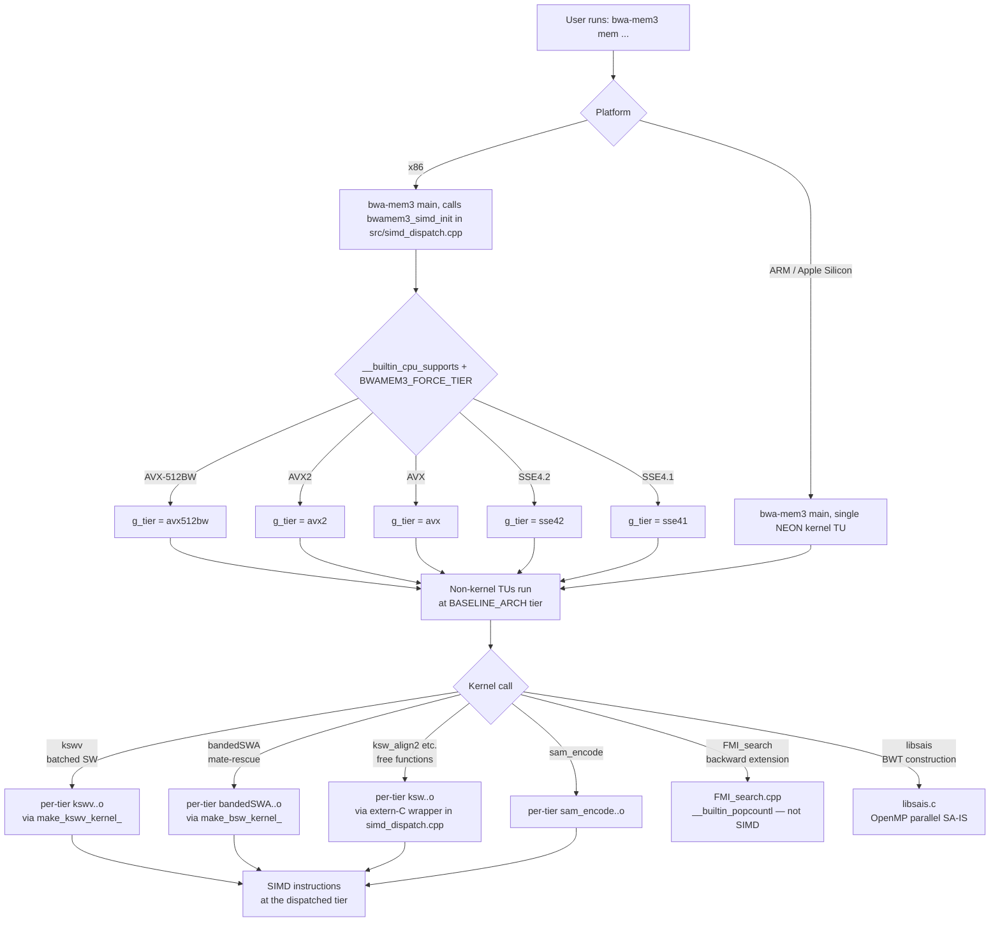

# SIMD dispatch architecture

bwa-mem3 uses two complementary mechanisms to run the best available
SIMD code path at run time: **in-process tier dispatch** on x86
(handled separately in
[Single-binary SIMD dispatch (x86)](launcher.md)) and **compile-time
conditional compilation** inside each kernel translation unit,
mediated by the per-target guards in the kernel headers, with
`src/kernel_dispatch.h` handling per-tier symbol renaming and
`src/simd_compat.h` serving as the ARM-only shim.

This page covers the compile-time layer: what the macros do, which
kernels are vectorised at each ISA level, and how the dispatch
decision flows from `main()` to a tier-specific kernel instruction.

## Platform and ISA selection

Platform and ISA detection lives in each **kernel header**
(`bandedSWA.h`, `kswv.h`, `ksw.h`) — there is no single abstraction
header that all SIMD code funnels through. Every kernel header opens
with an `#if`/`#elif` block that both selects the intrinsic source for
the target and sets the SIMD lane widths `SIMD_WIDTH8` / `SIMD_WIDTH16`:

| Target | Branch condition | Intrinsic source |
|---|---|---|
| ARM / Apple Silicon | `__ARM_NEON` or `__aarch64__` | `simd_compat.h` → `sse2neon.h` (translation) + `<arm_neon.h>` (native) |
| x86 AVX-512BW / AVX2 | `__AVX512BW__` / `__AVX2__` | `<immintrin.h>` |
| x86 AVX / SSE4.1 / SSE2 (else) | otherwise (incl. `__AVX__` without `__AVX2__`) | `<smmintrin.h>` / `<emmintrin.h>` |

There is no dedicated AVX branch in the kernel headers: an `__AVX__`-only x86
build (AVX present but not AVX2) takes the same `#else` (non-AVX2) branch as an
SSE build and compiles against that branch's 128-bit intrinsic source (16/8
lanes). Which header that is depends on the kernel — `<smmintrin.h>` (SSE4.1) in
the banded-SW kernel header, `<emmintrin.h>` (SSE2) in `ksw`. `src/simd_dispatch.cpp`
still tracks `avx` as a distinct **runtime** tier (host-capability detection and
`BWAMEM3_FORCE_TIER`), but at the kernel level AVX and SSE share the same
compiled code.

On x86 the kernel headers include the Intel intrinsic headers directly,
and the kernel TUs are compiled once per tier (see the next section).
On ARM they instead include `src/simd_compat.h`, the sse2neon-based
compatibility shim; there is a single NEON build.

### `src/simd_compat.h` — the ARM shim

`src/simd_compat.h` is **ARM-only**. It is reached solely through the
`__ARM_NEON` / `__aarch64__` branch above and guards against any non-ARM
inclusion with an `#error` — on x86 it is never seen, and x86 uses
`<immintrin.h>` directly. It is *not* a cross-tier abstraction layer.
The shim includes sse2neon (which maps the SSE intrinsics the kernels
use onto NEON), sets the NEON lane widths (`SIMD_WIDTH8 = 16`,
`SIMD_WIDTH16 = 8`), defines a `posix_memalign`-backed `_mm_malloc`
replacement that enforces the configurable `CACHE_LINE_BYTES` alignment
(128 on Apple Silicon, overridable to 64 for Neoverse/Graviton), and
provides two native-NEON helpers that sse2neon does not generate
efficiently:

- `_mm_movemask_epi16` — extracts the MSB of each 16-bit element using `vshrq_n_s16` + `vmovn_u16` + position-weighted `vaddv_u8`, replacing the `_mm_movemask_epi8(v) & 0xAAAA` pattern used in `bandedSWA.cpp`.
- `_mm_blendv_epi16_fast` — a bitwise select on 16-bit elements via NEON `vbslq_s16`, replacing the OR/AND/ANDNOT sequence sse2neon emits for `_mm_blendv_epi8`.

`SIMD_WIDTH8` and `SIMD_WIDTH16` control the lane counts in `kswv.cpp`
and `bandedSWA.cpp`. The kernel headers select these values per ISA;
on ARM, `simd_compat.h` is included first and its definitions take precedence.
The kernel headers' own `#ifndef`-guarded ARM definitions are fallbacks:

| ISA | `SIMD_WIDTH8` | `SIMD_WIDTH16` |
|---|---|---|
| SSE4.1 | 16 | 8 |
| AVX2 | 32 | 16 |
| AVX-512BW | 64 | 32 |
| ARM NEON | 16 | 8 |

## Per-tier compilation and symbol mangling

On x86 the four kernel translation units listed in `KERNEL_SRCS`
(`bandedSWA.cpp`, `kswv.cpp`, `ksw.cpp`, `sam_encode.cpp`) are
compiled **five times each** — once per supported tier
(`sse41` / `sse42` / `avx` / `avx2` / `avx512bw`) — with tier-specific
`-m...` flags. `src/kernel_dispatch.h` is a preprocessor-only header
that renames each exported kernel symbol per a
`KERNEL_VARIANT=_<tier>` macro, so the five tier compiles produce
non-colliding symbols that all link into one binary.

`bandedSWA.h` adds an abstract `IBandedPairWiseSW` interface;
`BandedPairWiseSW` is `final` and inherits from it. `kswv.h` mirrors
this with `Ikswv`. Each per-tier kernel TU exports a C-linkage factory
function (`make_bsw_kernel_<tier>`, `make_kswv_kernel_<tier>`) that
returns a `std::unique_ptr<I*>` to the tier-specific concrete class.
The dispatcher in `src/simd_dispatch.cpp` switches on `g_tier` and
calls the matching factory; the call sites in `bwamem.cpp` and
`bwamem_pair.cpp` see only the interface. This separation keeps the
dispatcher TU free of class-layout knowledge and sidesteps the ODR
risk that would arise from each tier's compile pulling in a
differently-laid-out concrete class definition.

The free-function `ksw_*` family (`ksw_extend2`, `ksw_global2`,
`ksw_extend`, `ksw_global`, `ksw_align2`, `ksw_align`) is dispatched
through thin `extern "C"` wrappers in `simd_dispatch.cpp` that switch
on `g_tier` and tail-call the matching mangled per-tier symbol.
Internal aux helpers in `ksw.cpp` (`ksw_qinit`, `ksw_u8`, `ksw_i16`)
are forced `static` so the five tier compiles do not multi-define
them. The SAM seq/qual encoder previously inlined in `bwamem.cpp` was
lifted into `src/sam_encode.{h,cpp}` so it also participates in
per-tier compilation.

All non-kernel TUs (`bwamem.cpp`, `bwamem_pair.cpp`, `fastmap.cpp`,
`FMI_search.cpp`, `bntseq.cpp`, …) compile **once** at the
`BASELINE_ARCH` tier (default `avx2`, set by the `make` line). They
call into the dispatcher's tier-agnostic entry points, which fan out
to the per-tier kernels at run time. See
[Single-binary SIMD dispatch (x86)](launcher.md) for the runtime
selection and override semantics, and
[`BASELINE_ARCH=avx512bw` build flag](../whats-different/avx512-baseline.md)
for why non-kernel TUs do not auto-vectorize at 512-bit by default.

On arm64 there is one NEON tier and one kernel compile per TU; the
dispatch tables collapse to single-entry switches and the per-tier
mangling layer is a no-op.

## Dispatch diagram

The full dispatch decision, from the shell to a kernel instruction,
follows this flow:

## Per-kernel vectorisation status

| Kernel | SSE4.1 | SSE4.2 | AVX | AVX2 | AVX-512BW | ARM NEON |
|---|---|---|---|---|---|---|
| `kswv` (batched Smith-Waterman) | 8-wide int16 | 8-wide int16 | 8-wide int16 | 16-wide int16 | 32-wide int16 | 8-wide int16 (native) |
| `bandedSWA` (banded SW / mate-rescue) | vectorised | vectorised | vectorised | vectorised | vectorised | native NEON blendv |
| `ksw_*` free functions (SW extension) | per-tier | per-tier | per-tier | per-tier | per-tier | per-tier (NEON) |
| `sam_encode` (SAM seq/qual encoder) | per-tier | per-tier | per-tier | per-tier | per-tier | per-tier (NEON) |
| `FMI_search` (FM-index backward ext.) | scalar | scalar | scalar | scalar | scalar | scalar |
| `libsais` (BWT / SA construction) | OpenMP only | OpenMP only | OpenMP only | OpenMP only | OpenMP only | OpenMP only |

`FMI_search` is memory-bound with sequential pointer-chasing
dependencies; adding SIMD to it produces no measurable speedup.
`libsais` benefits from OpenMP-parallel induced sorting but not from
SIMD widening within a single thread.

## Adding a new SIMD kernel

1. Select the intrinsic source with a platform guard that mirrors the existing kernel headers: include `simd_compat.h` under `#if defined(__ARM_NEON) || defined(__aarch64__)`, and the matching Intel header for the kernel's ISA level (`<immintrin.h>` for AVX2/AVX-512, `<smmintrin.h>` for SSE4.1, `<emmintrin.h>` for SSE2) on x86. Do not include `simd_compat.h` unguarded — it is ARM-only and `#error`s on x86.
2. Use `SIMD_WIDTH8` / `SIMD_WIDTH16` for lane-count arithmetic so the code compiles correctly across all ISA levels.
3. If the kernel needs per-tier compilation:
   - Add the source to `KERNEL_SRCS` in the Makefile so the per-tier pattern rules (`src/%.<tier>.o`) pick it up.
   - Use the `KERNEL_VARIANT` rename macros from `src/kernel_dispatch.h` to expose mangled symbols.
   - Export a C-linkage factory or dispatcher entry point from the per-tier TU and add a switch on `g_tier` in `src/simd_dispatch.cpp`.
4. For ARM-specific optimisations, gate them with the generic ARM guard `#if defined(__ARM_NEON) || defined(__aarch64__)` and provide an x86 equivalent on the other side of the guard that compiles correctly across every supported tier (`sse41` / `sse42` / `avx` / `avx2` / `avx512bw`) — the per-tier `-m...` flags select the actual instructions, so a single SSE/AVX intrinsic source normally covers all five; if a tier genuinely needs distinct code, add it and document the tiers that intentionally share a path. Validate byte-identical output across all x86 tiers with the parity harness in step 5, and cover lane-width and empty/padded-batch cases in the kernel's unit tests. Note that `APPLE_SILICON` is **not** an Apple-only macro — `simd_compat.h` defines it for *every* `__ARM_NEON`/`__aarch64__` build (Graviton, Neoverse, and Apple alike) — so use it (or `__ARM_NEON`) only when you mean all ARM targets; for genuinely Apple-specific code use an explicit guard such as `#if defined(__APPLE__) && defined(__aarch64__)`. ARM-only helper functions belong in `simd_compat.h`; their x86 counterparts come from the Intel intrinsic headers.
5. Verify correctness on at least SSE4.1 (lowest supported x86 tier) and ARM64 using `make test`, then run `test/regression/all_tiers_parity.sh` to confirm byte-identical SAM across every x86 tier under `BWAMEM3_FORCE_TIER`.

> **Tip — Testing SIMD correctness**
>
> The kswv unit tests in `test/unit/test_kswv*.cpp` use synthetic sequence-pair generators
> that drive edge cases (empty batches, nrow==0, homopolymers) across every SIMD width.
> Run them with `./test/bwa_mem3_tests_unit --test-suite="unit/kswv"` after modifying
> any vectorised kernel, then loop `BWAMEM3_FORCE_TIER` over all five tiers in an
> end-to-end smoke run to catch dispatcher-wiring regressions that the unit tests miss.

---

**See also:**
[Single-binary SIMD dispatch (x86)](launcher.md) ·
[Apple Silicon / NEON port](neon-port.md) ·
[Building from source](building.md) ·
[Performance → SIMD dispatch matrix](../performance/simd-dispatch.md) ·
[`BASELINE_ARCH=avx512bw` build flag](../whats-different/avx512-baseline.md) ·
[Regression test framework](regression-tests.md)
