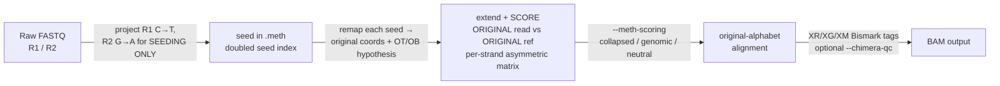

# Methylation Reference Overview

`bwa-mem3 mem --meth` is a single-binary, single-command methylation aligner,
supporting both **bisulfite/EM-seq** (the default) and **TAPS**
(`--meth=taps`). One `bwa-mem3 index --meth` builds the reference, and one
`bwa-mem3 mem --meth` aligns raw FASTQ to a sorted-ready BAM — no Python, no
piped read-conversion preprocessor, and no separate post-processing script.

> **Pick the chemistry.** Both chemistries convert C→T as far as the aligner can
> see, so the same index and scoring serve both — but they invert the *meaning*
> of the observed base, so `XM:Z` calls come out backwards if the chemistry is
> wrong. Bisulfite/EM-seq is the default; pass `--meth=taps` for TAPS libraries.
> See [Flags](flags.md#--methemseqtaps).

What sets it apart from the classic [bwameth.py](https://github.com/brentp/bwa-meth)
approach is **where the alignment is scored**. bwameth.py converts the reads
*and* the reference into 3-letter (C→T) space and aligns entirely in that
collapsed space. `bwa-mem3 --meth` only uses 3-letter space to **find seeds**;
it then extends, scores, and reports every alignment against the **original
4-letter reference** using a per-strand asymmetric substitution matrix. The
output is in the original alphabet with Bismark-compatible `XR`/`XG`/`XM` tags,
so one BAM serves both methylation calling and — in the variant-aware scoring
mode — variant calling, because real C/T and G/A variants stay literal
mismatches in `NM`/`MD`.

The non-`--meth` code path is byte-for-byte unchanged.

## Three scoring modes: `--meth-scoring`

Because scoring happens in 4-letter space, `--meth` can choose how lenient to be
about converted bases. This is controlled by `--meth-scoring`:

| Mode | Default? | Matrix | `-B` | Behavior |
|------|----------|--------|------|----------|
| **`collapsed`** | **`--meth` / `--meth=emseq`** | frees C↔T *and* G↔A both ways (two cells), each scored as a full match | `2` | bwameth-compatible **placement** — C/T and G/A are interchangeable, so it closely tracks bwameth's collapsed-space mapping. A close approximation, **not** exact: ~1% of records differ in `POS`/`CIGAR`/`MAPQ`, so re-validate if pinned to a bwameth release. |
| **`genomic`** | no (opt-in) | frees only the conversion direction (one cell), scored as a full match | `4` | **variant-aware** — a real C/T or G/A variant scores as a mismatch, so `NM`/`MD` are truthful and the BAM is usable for variant calling. |
| **`neutral`** | **`--meth=taps`** | frees only the conversion direction (one cell), scored `0` | `4` | **variant-aware and conservative** — a conversion is tolerated but not rewarded, so a sparse TAPS conversion no longer over-credits a spurious C→T alignment. `NM`/`MD` stay truthful; measured +0.24–0.28 pp placement over `genomic` on simulated TAPS. |

The default follows the chemistry: `--meth` and `--meth=emseq` default to
`collapsed`, so existing methylation pipelines see bwameth-compatible read
placement unless they explicitly opt into `genomic`; `--meth=taps` defaults to
`neutral`, because TAPS conversions are sparse (~3% of cytosines vs ~95% under
EM-seq) and collapsing costs specificity it can no longer repay. An explicit
`--meth-scoring` always overrides the chemistry default.

`collapsed` closely tracks bwameth's placement and emits the same Bismark tags,
but it is a placement drop-in — **not** byte-identical: ~1% of records differ in
`POS`/`CIGAR`/`MAPQ`, so re-validate if you are pinned to a specific bwameth
release. See [bwameth.py drop-in mapping](bwameth-mapping.md) for the full
placement-compatibility caveat, and [TAPS](taps.md) for the `neutral` measurements.

## Pipeline at a glance

The diagram below shows the internal flow when `bwa-mem3 mem --meth` runs. Every
step executes inside the single process; no external programs or temporary files
are required.



Steps:

1. **Seed projection.** Each read is projected into 3-letter space *for seeding
   only*: R1 has every `C` replaced with `T`, R2 has every `G` replaced with `A`.
   The original bases are preserved on a first-class per-read field
   (`bseq1_t.meth_orig_seq`) and drive scoring and output later. The projection
   is in-memory; the FASTQ is never rewritten.

2. **Seeding against the `.meth` doubled seed index.** The projected read is
   seeded against the converted seed FM-index (`<ref>.meth.*`), which contains a
   forward C→T projection (`f`-prefixed contigs) and a reverse G→A projection
   (`r`-prefixed contigs) of each chromosome.

3. **Seed remap to original coordinates.** Every seed is mapped back to original
   genome coordinates, and the contig prefix it came from sets a strand
   hypothesis: `f` → OT (top strand), `r` → OB (bottom strand). This hypothesis
   selects the per-strand matrix and feeds the Bismark `XG:Z` tag.

4. **4-letter extension and scoring.** The **original** read is extended and
   scored against the **original** 4-letter reference window using the per-strand
   asymmetric matrix (see [`--meth-scoring`](#three-scoring-modes---meth-scoring)).
   OT frees ref-`C` × read-`T` (the unmethylated C→T conversion); OB frees
   ref-`G` × read-`A`. The seed's own true score is recomputed in this matrix too,
   so a seed-internal variant correctly lowers the alignment score rather than
   being assumed a perfect match.

5. **Original-alphabet output.** Records are written against the original
   chromosome names and coordinates, with the original read bases in `SEQ`, plus
   Bismark `XR:Z` (read conversion), `XG:Z` (genome strand), and `XM:Z` (per-base
   methylation call) tags. Optional `--chimera-qc` (off by default, matching
   Bismark) flags chimeric reads. The `@PG ID:bwa-mem3-meth` line records the
   command line. Output is uncompressed BAM (`wb0`); pipe directly to
   `samtools sort`.

## Quick-start commands

```bash
# Index once: builds the normal index at the bare prefix PLUS a .meth seed index.
bwa-mem3 index --meth ref.fa

# Align paired-end FASTQs (collapsed = bwameth-compatible placement, the default).
bwa-mem3 mem --meth -t 16 ref.fa R1.fq.gz R2.fq.gz \
  | samtools sort -o out.bam
samtools index out.bam

# Opt into variant-aware scoring (truthful NM/MD; BAM usable for variant calling).
bwa-mem3 mem --meth --meth-scoring genomic -t 16 ref.fa R1.fq.gz R2.fq.gz \
  | samtools sort -o out.bam

# TAPS: --meth=taps sets the TAPS XM:Z polarity and defaults to neutral scoring.
bwa-mem3 mem --meth=taps -t 16 ref.fa R1.fq.gz R2.fq.gz \
  | samtools sort -o out.bam
```

> **Note — scoring defaults**
>
> `--meth` applies `-L 10 -U 100 -T 40 -M -C` in every mode, plus the
> mode-dependent mismatch penalty: `-B 2` for `collapsed`, `-B 4` for `genomic`
> and `neutral`. These mirror bwameth's `bwa mem -T 40 -B 2 -L 10 -CM` (with
> `-U 100` for paired-end). The scoring values (`-B`, `-L`, `-U`, `-T`) can be
> overridden on the command line, in any position relative to `--meth`. `-M` and
> `-C` cannot — bwa has no option that unsets them, so `--meth` applies them
> unconditionally.
>
> These constants are quoted at bwa's default match score (`-A 1`, what bwameth
> runs). Like every other score-derived default, they scale with `-A`: under
> `-A 2` the effective values are `-L 20 -U 200 -T 80` and `-B 4`/`-B 8`.

---

**See also:**
[bwameth.py drop-in mapping](bwameth-mapping.md) ·
[Conversion details](conversion.md) ·
[SAM tags: XR, XG, XM](tags.md) ·
[Chimera QC and header rewriting](post-processing.md) ·
[Quick start: methylation alignment](../getting-started/quick-meth.md)
