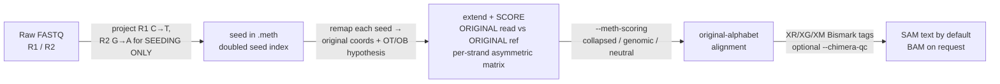

# Methylation Reference Overview

`bwa-mem3 mem --meth` is a single-binary, single-command methylation aligner,
supporting both **bisulfite/EM-seq** (the default) and **TAPS**
(`--meth=taps`). One `bwa-mem3 index --meth` builds the reference, and one
`bwa-mem3 mem --meth` aligns raw FASTQ to sorted-ready records — no Python, no
piped read-conversion preprocessor, and no separate post-processing script.
`--meth` selects alignment semantics only; the output container is `--bam`'s
job — SAM text by default, BAM with `--bam`.

> **Pick the chemistry.** Both chemistries convert C→T as far as the aligner can
> see, so the same index and scoring serve both — but they invert the *meaning*
> of the observed base, so `XM:Z` calls come out backwards if the chemistry is
> wrong. Bisulfite/EM-seq is the default; pass `--meth=taps` for TAPS libraries.
> See [Flags](flags.md#--methemseqtaps).

What sets it apart from the classic [bwameth.py](https://github.com/brentp/bwa-meth)
approach is **where the alignment is scored**. bwameth.py converts the reads
*and* the reference into 3-letter (C→T) space and aligns entirely in that
collapsed space. `bwa-mem3 --meth` only uses 3-letter space to **find seeds**;
it then extends, scores, and reports every alignment against the **original
4-letter reference** using a per-strand asymmetric substitution matrix. The
output is in the original alphabet with Bismark-compatible `XR`/`XG`/`XM` tags,
so one BAM serves both methylation calling and — in the variant-aware scoring
modes — variant calling, because a real variant the matrix penalises counts
toward `NM` while a bisulfite conversion does not. The exception is a
variant in the conversion direction itself (a genuine C→T at a reference `C`),
which no single read can tell apart from a conversion — see
[how `NM`/`MD` are computed](#how-nmmd-are-computed-under---meth).

`--meth` adds no divergence to the non-`--meth` path: without the flag, output
is unchanged. As everywhere on this fork, a byte comparison that demonstrates
that must hold the batch partition fixed — compare at the same `-t`, or pass
`-K` to both sides — since batch boundaries feed `mem_pestat` and can move a
small number of records on their own. See
[Equivalence → batch size, `-t`, and why comparisons need `-K`](../whats-different/equivalence.md#batch-size--t-and-why-comparisons-need--k).

## How `NM`/`MD` are computed under `--meth`

Under `--meth`, an aligned substitution (a read base aligned to a different
reference base) counts toward `NM` **iff the scoring matrix penalises it**, the
same matrix that drives the DP. The per-strand asymmetric matrix scores the
conversion cell (ref `C` × read `T` on OT, ref `G` × read `A` on OB) as a match
under `collapsed` and `genomic`, and as `0` under `neutral`. In every mode the
matrix does not penalise a bisulfite conversion, so it is not an edit for `NM`
and costs nothing in the alignment score; `neutral` also does not reward it. A
perfectly converted read is `NM:i:0`. Insertions and deletions are not matrix
cells: every inserted and every deleted base still counts toward `NM`, exactly
as without `--meth`.

`MD` stays literal. It lists every reference base the read differs from,
conversions included, so `CIGAR` + `SEQ` + `MD` rebuilds the real reference
(`samtools calmd` reproduces it exactly) and every converted base can be read
off the record without the reference. A perfectly converted read's `MD` names
each converted reference `C` (OT) or `G` (OB).

So under `--meth`, `NM` is smaller than the edit count `MD` and `CIGAR` imply, by
the number of columns the matrix frees. Tools that recompute `NM` from the
reference report it as different, and that is expected. On 60,000 simulated
EM-seq pairs (a 900 kb reference with random SNPs and indels, `--meth-scoring
genomic`; arm64, macOS, NEON tier), `samtools calmd` (1.23.1) and Picard
`ValidateSamFile` (3.4.0) both flagged `NM` on the 118,922 of 120,000 records
whose `NM` excludes at least one conversion, while `calmd` left every `MD`
unchanged. Both tools already flagged that `NM` before `MD` became literal.

There is no bisulfite special case in the `NM` code: one definition, "an edit
is what the scoring model penalises", produces both the score and `NM`, so `NM`
automatically tracks whatever `--meth-scoring` selects.

### Which real variants stay visible

The same rule decides that too. Under the variant-aware modes (`genomic`,
`neutral`) the matrix frees *only* the conversion cell, so every penalised
substitution counts toward `NM`, including a C/T or G/A variant in
the **opposite** direction (ref `T` × read `C` on OT, ref `A` × read `G` on OB),
which is what makes the BAM usable for variant calling. But a variant in the
**conversion direction itself** — a genuine C→T SNP at a reference `C` on OT, or
G→A at a reference `G` on OB — lands on that same freed cell and is therefore
*absent* from `NM`: it is byte-indistinguishable from a conversion in a
single read, so no aligner can separate the two. Under `collapsed` the mirror
cell is freed as well, so C/T and G/A variants are hidden from `NM` in both
directions. `MD` lists all of them in every mode.

> **This is a deliberate deviation from the SAM specification**
> ([#332](https://github.com/fg-labs/bwa-mem3/pull/332), [#550](https://github.com/fg-labs/bwa-mem3/pull/550)), which defines `NM` as
> the edit distance to the reference. Under `--meth`, `NM` is not literal: a
> converted base is not counted as an edit against a reference base it differs
> from. `MD` is literal, as the specification defines it. Other bisulfite
> aligners differ here. bwameth.py hides conversions in both tags by aligning in
> collapsed space. BISCUIT hides them in `NM` only, which it defines as
> "non-cytosine-conversion mismatches" (the literal value is `NM` + `ZC`), and
> keeps `MD` literal. Bismark hides them in neither: its `NM` is the Hamming
> distance plus indels between the read and the unconverted reference, and its
> `MD` lists every converted base (measured with Bismark v0.24.2 and the v3.1.0
> Rust port on end-to-end alignments of simulated directional reads). `--meth`
> takes the BISCUIT convention (`NM` excludes conversions, `MD` is literal).
> Under `collapsed`, `NM` also excludes C/T and G/A variants in the mirror
> direction, which BISCUIT's `NM` would count. A literal `NM` makes an error-free bisulfite
> library look roughly 20 % divergent on a human genome (about one base in five
> is a converted C) to every downstream `NM` filter and QC metric, so `NM`
> excludes conversions. Hiding them from `MD` as well would buy nothing for
> filtering and would throw away the only per-base record of the conversions,
> so `MD` stays literal. The non-`--meth` path is unaffected and remains
> spec-literal.
>
> A single read cannot distinguish a bisulfite C→T from a real C→T SNP; that
> aliasing is resolved downstream at the pileup. `NM` reports what the scoring
> model treats as divergence rather than adjudicating chemistry against genotype
> base by base.

## Three scoring modes: `--meth-scoring`

Because scoring happens in 4-letter space, `--meth` can choose how lenient to be
about converted bases. This is controlled by `--meth-scoring`:

| Mode | Default? | Matrix | `-B` | Behavior |
|------|----------|--------|------|----------|
| **`collapsed`** | **`--meth` / `--meth=emseq`** | frees C↔T *and* G↔A both ways (two cells), each scored as a full match | `2` | bwameth-compatible **placement** — C/T and G/A are interchangeable, so it closely tracks bwameth's collapsed-space mapping. A close approximation, **not** exact: ~1% of records differ in `POS`/`CIGAR`/`MAPQ` on typical WGBS/EM-seq ([full caveat](bwameth-mapping.md)), so re-validate if pinned to a bwameth release. |
| **`genomic`** | no (opt-in) | frees only the conversion direction (one cell), scored as a full match | `4` | **variant-aware** — the mirror cell stays penalised, so a real C/T or G/A variant scores as a mismatch and counts toward `NM`, making the BAM usable for variant calling. A variant in the conversion direction itself is still not counted in `NM`, though `MD` lists it ([why](#which-real-variants-stay-visible)). |
| **`neutral`** | **`--meth=taps`** | frees only the conversion direction (one cell), scored `0` | `4` | **variant-aware and conservative** — a conversion is tolerated but not rewarded, so a sparse TAPS conversion no longer over-credits a spurious C→T alignment. Real variants count toward `NM` on the same terms as `genomic`; +0.24–0.28 pp placement over `genomic`, measured on 4.07 M simulated TAPS reads against full hg38 across three methylation loads ([full arms and method](taps.md#what---methtaps-changes)). |

The default follows the chemistry: `--meth` and `--meth=emseq` default to
`collapsed`, so existing methylation pipelines see bwameth-compatible read
placement unless they explicitly opt into `genomic`; `--meth=taps` defaults to
`neutral`, because TAPS conversions are sparse (~3% of cytosines vs ~95% under
EM-seq) and collapsing costs specificity it can no longer repay. An explicit
`--meth-scoring` always overrides the chemistry default.

`collapsed` closely tracks bwameth's placement and emits the same Bismark tags,
but it is a placement drop-in — **not** byte-identical: ~1% of records differ in
`POS`/`CIGAR`/`MAPQ`, so re-validate if you are pinned to a specific bwameth
release. See [bwameth.py drop-in mapping](bwameth-mapping.md) for the full
placement-compatibility caveat, and [TAPS](taps.md) for the `neutral` measurements.

## Pipeline at a glance

The diagram below shows the internal flow when `bwa-mem3 mem --meth` runs. Every
step executes inside the single process; no external programs or temporary files
are required.


```mermaid
flowchart LR
    A[Raw FASTQ\nR1 / R2] -->|project R1 C→T,\nR2 G→A for SEEDING ONLY| B[seed in .meth\ndoubled seed index]
    B -->|remap each seed →\noriginal coords + OT/OB hypothesis| C[extend + SCORE\nORIGINAL read vs ORIGINAL ref\nper-strand asymmetric matrix]
    C -->|--meth-scoring\ncollapsed / genomic / neutral| D[original-alphabet\nalignment]
    D -->|XR/XG/XM Bismark tags\noptional --chimera-qc| E[SAM text by default\nBAM on request]
```

Steps:

1. **Seed projection.** Each read is projected into 3-letter space *for seeding
   only*: R1 has every `C` replaced with `T`, R2 has every `G` replaced with `A`.
   The original bases are preserved on a first-class per-read field
   (`bseq1_t.meth_orig_seq`) and drive scoring and output later. The projection
   is in-memory; the FASTQ is never rewritten.

2. **Seeding against the `.meth` doubled seed index.** The projected read is
   seeded against the converted seed FM-index (`<ref>.meth.*`), which contains a
   forward C→T projection (`f`-prefixed contigs) and a reverse G→A projection
   (`r`-prefixed contigs) of each chromosome.

3. **Seed remap to original coordinates.** Every seed is mapped back to original
   genome coordinates, and the contig prefix it came from sets a strand
   hypothesis: `f` → OT (top strand), `r` → OB (bottom strand). This hypothesis
   selects the per-strand matrix and feeds the Bismark `XG:Z` tag.

4. **4-letter extension and scoring.** The **original** read is extended and
   scored against the **original** 4-letter reference window using the per-strand
   asymmetric matrix (see [`--meth-scoring`](#three-scoring-modes---meth-scoring)).
   OT frees ref-`C` × read-`T` (the unmethylated C→T conversion); OB frees
   ref-`G` × read-`A`. The seed's own true score is recomputed in this matrix too,
   so a seed-internal variant correctly lowers the alignment score rather than
   being assumed a perfect match.

5. **Original-alphabet output.** Records are written against the original
   chromosome names and coordinates, with the original read bases in `SEQ`, plus
   Bismark `XR:Z` (read conversion), `XG:Z` (genome strand), and `XM:Z` (per-base
   methylation call) tags. Optional `--chimera-qc` (off by default, matching
   Bismark) flags chimeric reads. The `@PG ID:bwa-mem3-meth` line records the
   command line. Output is SAM text by default and uncompressed BAM (`wb0`)
   under `--bam`; pipe either directly to `samtools sort`.

## Quick-start commands

```bash
# Index once: builds the normal index at the bare prefix PLUS a .meth seed index.
bwa-mem3 index --meth ref.fa

# Align paired-end FASTQs (collapsed = bwameth-compatible placement, the default).
bwa-mem3 mem --meth -t 16 ref.fa R1.fq.gz R2.fq.gz \
  | samtools sort -o out.bam
samtools index out.bam

# Opt into variant-aware scoring (variants outside the conversion direction stay
# counted in NM; BAM usable for variant calling).
bwa-mem3 mem --meth --meth-scoring genomic -t 16 ref.fa R1.fq.gz R2.fq.gz \
  | samtools sort -o out.bam

# TAPS: --meth=taps sets the TAPS XM:Z polarity and defaults to neutral scoring.
bwa-mem3 mem --meth=taps -t 16 ref.fa R1.fq.gz R2.fq.gz \
  | samtools sort -o out.bam
```

> **Note — scoring defaults**
>
> `--meth` applies `-L 10 -U 100 -T 40 -M -C` in every mode, plus the
> mode-dependent mismatch penalty: `-B 2` for `collapsed`, `-B 4` for `genomic`
> and `neutral`. These mirror bwameth's `bwa mem -T 40 -B 2 -L 10 -CM` (with
> `-U 100` for paired-end). The scoring values (`-B`, `-L`, `-U`, `-T`) can be
> overridden on the command line, in any position relative to `--meth`. `-M` and
> `-C` cannot — bwa has no option that unsets them, so `--meth` applies them
> unconditionally.
>
> These constants are quoted at bwa's default match score (`-A 1`, what bwameth
> runs). Like every other score-derived default, they scale with `-A`: under
> `-A 2` the effective values are `-L 20 -U 200 -T 80` and `-B 4`/`-B 8`.

---

**See also:**
[bwameth.py drop-in mapping](bwameth-mapping.md) ·
[Conversion details](conversion.md) ·
[SAM tags: XR, XG, XM](tags.md) ·
[Chimera QC and header construction](post-processing.md) ·
[Quick start: methylation alignment](../getting-started/quick-meth.md)
