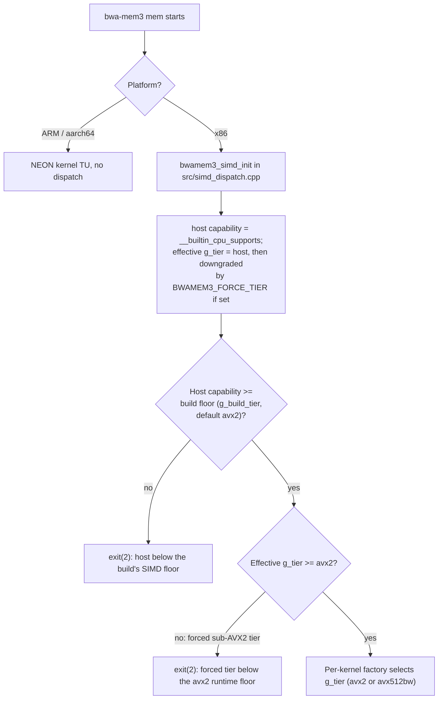

# SIMD Dispatch Matrix

bwa-mem3 ships **one binary per platform**. The x86 binary contains
compiled kernels for every supported SIMD tier
(`sse41` / `sse42` / `avx` / `avx2` / `avx512bw`) and dispatches in
process at startup. The arm64 binary contains a single NEON kernel
path. There are no `bwa-mem3.<tier>` companion files on disk and no
launcher binary.

## Dispatch flowchart



The two `exit(2)` gates are `bwamem3_enforce_host_floor()`'s two
checks: first the host capability against the compile-time build floor
(`g_build_tier`, default `avx2`; `BASELINE_ARCH=avx512bw` raises it),
then the effective tier against the absolute `avx2` runtime floor —
which only a `BWAMEM3_FORCE_TIER` downgrade can trip, since `g_tier`
otherwise defaults to the host tier.

The default (`BASELINE_ARCH=avx2`) build's floor is AVX2, so on that
build an unforced host below AVX2 (AVX, SSE4.2, SSE4.1) is rejected by
`bwamem3_enforce_host_floor()` with `exit(2)` before any kernel
dispatch — it never reaches the tier factory. The floor is compile-time
(`g_build_tier`, set by `BASELINE_ARCH`): a `BASELINE_ARCH=avx512bw`
build raises it to AVX-512BW and rejects an AVX2-only host the same way.
A forced sub-AVX2 `mem` run
(`BWAMEM3_FORCE_TIER=sse41|sse42|avx`) is refused the same way;
`version` / help bypass the floor and may still surface a sub-AVX2 tier
name for introspection. Automatic alignment dispatch therefore selects
only `avx2` or `avx512bw`.

Tier detection runs once during `main()`. Subsequent kernel calls pay
a single indirect-call hop through a factory vtable (or an
`extern "C"` wrapper for free-function `ksw_*` kernels) — about
0.3 ns per call after BTB warm-up, well below run-to-run noise on the
[benchmark](benchmarks.md) corpus.

If the host CPU does not meet the build's compile-time SIMD floor
(`BASELINE_ARCH`, default `avx2` since PR #84), the binary exits with
code 2 and an `[E::bwamem3]` message naming the gap before any
alignment work runs. `bwa-mem3 version`, `--help`, and `-h` are
exempt and always succeed so operators can introspect a binary on a
host that cannot run alignment. See
[Host requirements](../getting-started/host-requirements.md).

## `BASELINE_ARCH` and the kernel tiers

The build targets (`make`, `make arch=…`, `make BASELINE_ARCH=…`, `make arm64`)
are documented in [Best Practices → Build](../best-practices/build.md). What
matters for dispatch is `BASELINE_ARCH`:

`BASELINE_ARCH` controls the tier at which non-kernel translation
units compile. The hand-tuned kernel TUs in `KERNEL_SRCS`
(`bandedSWA`, `kswv`, `ksw`, `sam_encode`) are always compiled at
every supported tier and dispatched at runtime, so a build at
`BASELINE_ARCH=avx2` still uses the AVX-512BW kernels on AVX-512BW
hosts. The non-kernel TUs are not auto-vectorized above
`BASELINE_ARCH`, which is the trade-off — see
[`BASELINE_ARCH=avx512bw` build flag](../whats-different/avx512-baseline.md)
for the empirical perf characterization.

Supported x86 tiers (minimum CPU for each tier's kernel path):

| Tier | Arch flags | Minimum CPU |
|---|---|---|
| `sse41` | `-msse4.1` | Penryn (2007) / K10 (2011) |
| `sse42` | `-msse4.2` | Nehalem (2008) / Bulldozer (2011) |
| `avx` | `-mavx` | Sandy Bridge (2011) / Bulldozer (2011) |
| `avx2` | `-mavx2` | Haswell (2013) / Excavator (2015) |
| `avx512bw` | `-mavx512f -mavx512bw -mprefer-vector-width=256` | Skylake-X (2017) / Zen 4 (2022) |

> **AVX2 is the runtime floor.** The `sse41` / `sse42` / `avx` kernel objects are still compiled so the dispatch vtable links on every tier, but a shipping build's non-kernel TUs require AVX2 (the host-floor precheck refuses to start below it) and the batched `kswv` mate-rescue kernel has no sub-AVX2 implementation. Automatic alignment dispatch therefore never selects those three tiers. Diagnostic commands and alignment commands differ in how they treat a forced sub-AVX2 tier: `version` / help bypass `bwamem3_enforce_host_floor()`, so an explicit `BWAMEM3_FORCE_TIER=sse41|sse42|avx` can still surface a sub-AVX2 tier name for introspection. An alignment run (`mem`) cannot: `bwamem3_enforce_host_floor()` refuses any effective tier below AVX2 up front with `exit(2)` — before any kernel dispatch — so a paired-end `mem` run never reaches the sub-AVX2 `kswv` `getScores8`/`getScores16` stubs. `avx2` and `avx512bw` are the reachable x86 alignment tiers.

For arm64 builds:

| Binary | Arch flags | Platform |
|---|---|---|
| `bwa-mem3` (arm64) | `-DAPPLE_SILICON=1` + native NEON / sse2neon shim | Any aarch64 / Apple Silicon |

## Kernel vectorization coverage

| Kernel | SSE4.1 | SSE4.2 | AVX | AVX2 | AVX-512BW | NEON (arm64) |
|---|---|---|---|---|---|---|
| `kswv` (vectorized Smith-Waterman) | 8-wide int16 | 8-wide int16 | 8-wide int16 | 16-wide int16 | 32-wide int16 | 8-wide int16 (native) |
| `bandedSWA` (banded alignment / mate-rescue) | vectorized | vectorized | vectorized | vectorized | vectorized | native NEON movemask |
| `ksw_*` (SW extension free functions) | per-tier | per-tier | per-tier | per-tier | per-tier | per-tier (NEON) |
| `sam_encode` (SAM seq/qual encoder) | per-tier | per-tier | per-tier | per-tier | per-tier | per-tier (NEON) |
| FM-index lookup (`FMI_search`) | scalar popcount | scalar popcount | scalar popcount | scalar popcount | scalar popcount | `__builtin_popcountl` |
| libsais BWT construction | scalar | scalar | scalar | OpenMP parallel | OpenMP parallel | OpenMP parallel |

> **Note — FM-index is memory-bound**
>
> The FM-index backward-extension loop is limited by pointer-chasing through the `cp_occ` arrays, not by computation. Additional SIMD width does not increase throughput here. See [Developer Guide — Apple Silicon / NEON port](../developer-guide/neon-port.md) for the profiling evidence.

## Runtime overrides

Two environment variables tune dispatch:

| Variable | Effect |
|---|---|
| `BWAMEM3_FORCE_TIER=<tier>` | Forces a specific tier (`sse41` / `sse42` / `avx` / `avx2` / `avx512bw`). Downgrade-only: requests above the host's detected tier (which would SIGILL) and unknown names are rejected with a stderr warning. Used by `test/regression/all_tiers_parity.sh`, which re-runs the same binary and `mem` command under each reachable tier (`avx2` / `avx512bw`; a forced sub-AVX2 `mem` run is refused before dispatch) — fixed paired-end workload, `-t 1`, pinned `-K`, one AVX-512BW host — and `diff`s the complete SAM. Because only the kernel tier changes between runs, the `@PG` / `@HD` headers are identical too, so byte-identity here covers the whole file, not only the alignment records scoped by the cross-build equivalence contract. |
| `BWAMEM3_DEBUG_SIMD=1` | Prints a one-line `[I::bwamem3_simd_init_body]` startup banner with the build baseline, the detected host capability, and the resolved tier. Also enables the build-baseline-vs-host gap warning. |

Use `bwa-mem3 version` to read the resolved tier without alignment:

```text
v0.2.0
SIMD floor:   avx2 (x86-64-v3, Haswell 2013+); kernels: sse41 sse42 avx avx2 avx512bw
SIMD runtime: avx512bw (BWAMEM3_FORCE_TIER unset)
```

## Why in-process dispatch, not separate binaries

The pre-PR-#83 design shipped six binaries (one launcher plus one
per ISA tier) and `execv`d the matching tier at startup. That worked
but cost ~120 MB on disk, required all six binaries to be present in
the same directory, and made `BWAMEM3_FORCE_TIER` impossible without
re-exec'ing a different file. The current single-binary design keeps
the per-tier compile granularity for the hand-tuned kernel TUs while
collapsing distribution to one file (~25 MB), and adds runtime tier
override and a clean host-floor precheck. Indirect-call overhead is
the only trade-off, and it is below the measurement noise floor on
every architecture in the bench matrix.

---

**See also:**
[Performance overview](overview.md) ·
[PGO build](pgo.md) ·
[Host requirements](../getting-started/host-requirements.md) ·
[Developer Guide — SIMD dispatch architecture](../developer-guide/simd-dispatch.md) ·
[Developer Guide — Single-binary SIMD dispatch (x86)](../developer-guide/launcher.md) ·
[Developer Guide — Apple Silicon / NEON port](../developer-guide/neon-port.md) ·
[`BASELINE_ARCH=avx512bw` build flag](../whats-different/avx512-baseline.md)
