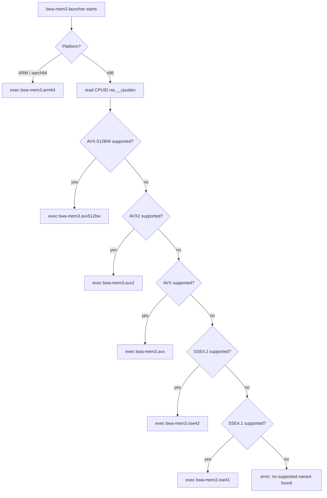

# SIMD Dispatch Matrix

bwa-mem3 uses a multi-binary dispatch strategy on x86: the `bwa-mem3` launcher reads the CPU's CPUID bits at startup, then `execv`s the highest-capability variant binary found on disk. On ARM there is only one NEON level, so the launcher execs `bwa-mem3.arm64` directly without any cpuid check.

## Dispatch flowchart



The launcher reads CPUID leaf 1 (for SSE flags) and leaf 7 (for AVX2 and AVX-512 flags). It checks in descending capability order and stops at the first variant binary it finds on disk. If no variant binary is executable, it exits with an error.

The ARM path always tries `bwa-mem3.arm64` first, then falls back to the bare `bwa-mem3` name (which on ARM is a symlink to `bwa-mem3.arm64` created by `make arm64`).

## Building the variant binaries

`make multi` builds all five x86 variants and the launcher in sequence:

```bash
make multi
```

This produces:

| Filename | Arch flags | Minimum CPU |
|---|---|---|
| `bwa-mem3.sse41` | `-msse4.1` | Penryn (2007) / K10 (2011) |
| `bwa-mem3.sse42` | `-msse4.2` | Nehalem (2008) / Bulldozer (2011) |
| `bwa-mem3.avx` | `-mavx` | Sandy Bridge (2011) / Bulldozer (2011) |
| `bwa-mem3.avx2` | `-mavx2` | Haswell (2013) / Excavator (2015) |
| `bwa-mem3.avx512bw` | `-mavx512f -mavx512bw` | Skylake-X (2017) / Zen 4 (2022) |

For ARM builds, `make arm64` produces a single binary and creates the symlink:

| Filename | Arch flags | Platform |
|---|---|---|
| `bwa-mem3.arm64` | `-DAPPLE_SILICON=1` + sse2neon shim | Any aarch64 / Apple Silicon |

To build a single-arch binary for a known target (e.g. for a cluster with uniform hardware):

```bash
make arch=avx2
```

The resulting binary is named `bwa-mem3` and contains only AVX2 code. The launcher is not built; it is not needed when the target ISA is fixed.

## Kernel vectorization coverage

The table below lists the kernels that have SIMD implementations and which ISA levels they cover.

| Kernel | SSE4.1 | SSE4.2 | AVX | AVX2 | AVX-512BW | NEON (arm64) |
|---|---|---|---|---|---|---|
| kswv (vectorized Smith-Waterman) | 8-wide int16 | 8-wide int16 | 8-wide int16 | 16-wide int16 | 32-wide int16 | 8-wide int16 (native) |
| bandedSWA (banded alignment) | SSE2 baseline | SSE2 baseline | SSE2 baseline | SSE2 baseline | SSE2 baseline | native NEON blendv |
| FM-index lookup (FMI_search) | SSE popcount | SSE popcount | SSE popcount | SSE popcount | SSE popcount | __builtin_popcountl |
| libsais BWT construction | scalar | scalar | scalar | OpenMP parallel | OpenMP parallel | OpenMP parallel |

> **Note — FM-index is memory-bound**
>
> The FM-index backward-extension loop is limited by pointer-chasing through the `cp_occ` arrays, not by computation. Additional SIMD width does not increase throughput here. See the Apple Silicon optimization log in [Developer Guide — Apple Silicon / NEON port](../developer-guide/neon-port.md) for the profiling evidence.

## Why the launcher uses execv, not a function pointer

The multi-binary design was inherited from bwa-mem2. Separate compilation units mean the compiler can use the target ISA's full instruction set throughout — not just in hand-vectorized loops but also in auto-vectorized loops, register allocation, and branch heuristics. A single-binary dispatcher that calls ISA-specific function pointers achieves the same for hand-written kernels but leaves the compiler's auto-vectorization gated at the baseline ISA. For a workload with this many scalar loops, the execv approach yields a measurable difference. For the ARM path, all CPUs have the same NEON level so the single-binary approach is fine.

---

**See also:**
[Performance overview](overview.md) ·
[PGO build](pgo.md) ·
[Developer Guide — SIMD dispatch architecture](../developer-guide/simd-dispatch.md) ·
[Developer Guide — Multi-binary launcher (x86)](../developer-guide/launcher.md) ·
[Developer Guide — Apple Silicon / NEON port](../developer-guide/neon-port.md)
